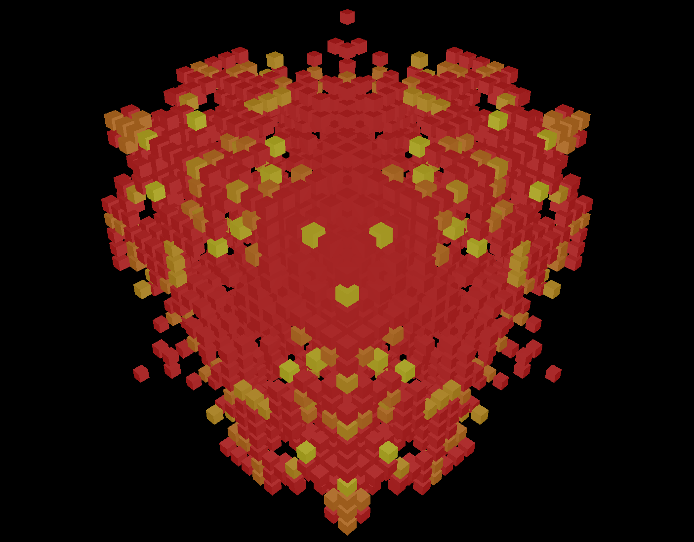

Game of Life 3D
===============

A 3D version of the well-known Conway's Game of Life, written in Rust.

Status
------

* The game take place in a cube
* Each cube represents a cell
* The cell color represents its age
* The user can turn around the cube
* The user can select the game speed
* The user can select the game size

Future goals
------------

I will probably use this project to try some libraries or to improve my skills
on some feature of the Rust programming language, so it might become overbloat
and over-engineered, but nobody should care about it since it does nothing
useful anyway.

However, while doing so, the goal is to maintain decent performances or to
improve them.

A few ideas:

- [ ] A way to reconfigure the game in real-time
  - [ ] from a Lua shell
  - [ ] from a REST API
  - [ ] from a GraphQL API
- [ ] Add a way to customize colorscheme
- [ ] Automatically move the camera
- [ ] Run clippy and rustfmt on the code
- [ ] Compile to WebAssembly to render in a browser
- [ ] Add a client/server architecture
- [ ] Optionnally compile some features with flags in Cargo.toml
- [ ] Change light and cells colors accordings to the sound card output
- [ ] Add some visual effects/edit some GLSL
- [ ] Use rayon in some ways (probably to optimize the maximum size of the game
      board an average computer can compute)
- [ ] Use tokio in some ways (why not?)
- [ ] Use OpenCL?
- [ ] Use SIMD?
